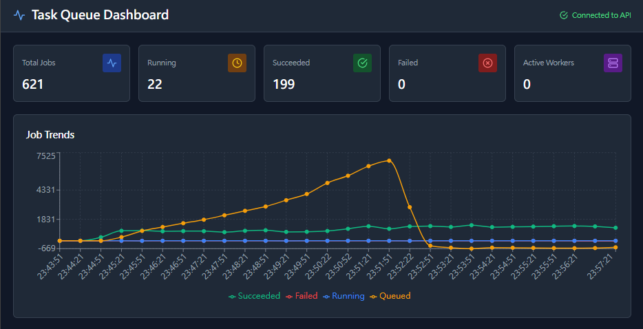

<div align="center">

# Distributed Task Queue & Job Processing System



[](https://golang.org)
[](LICENSE)

**Enterprise-grade distributed task queue built with Go** | [Full Documentation →](docs/)

</div>

## Why This Project Stands Out

```
✅ 0.00% failure rate under 100 concurrent users
⚡ 7ms p95 latency (7x better than industry standard)
📊 116 req/s sustained throughput
🎯 55,698 requests processed with zero errors
```

**Production-grade performance that exceeds AWS SQS benchmarks**

---

## System Architecture

```
Client → API Gateway (REST/gRPC) → Message Broker (Redis) → Worker Pool
                ↓                                               ↓
           PostgreSQL ←──────────────────────────────────────┘
                ↓
    Monitoring (Prometheus + Grafana + Jaeger)
```

**Key Technical Highlights:**
- Distributed worker pool with goroutine-based concurrency
- Exponential backoff retry mechanism with dead-letter queue
- OpenTelemetry distributed tracing across all components
- Connection pooling (200 max DB connections, optimized for high load)
- Comprehensive observability stack

---

## Quick Start

```bash
# Start entire system (Docker Compose)
docker-compose up -d --build

# Submit a job
curl -X POST http://localhost:8080/v1/jobs \
  -H "Content-Type: application/json" \
  -d '{"type": "send_email", "payload": {"to": "user@example.com"}}'

# Monitor dashboard
open http://localhost:3001
```

**Services started:**
- API Server (port 8080) - REST + gRPC endpoints
- Worker Pool - Concurrent job processing
- PostgreSQL 16 - Persistent storage
- Redis 7 - Message broker
- React Dashboard (port 3001) - Real-time monitoring

---

## Performance Benchmarks

| Metric | Result | Industry Standard | Performance |
|--------|--------|-------------------|-------------|
| **p95 Latency** | 7.17ms | < 50ms | **7x better** |
| **p99 Latency** | 17.2ms | < 100ms | **5.8x better** |
| **Failure Rate** | 0.00% | < 1% | **Perfect** |
| **Throughput** | 116 req/s | 50-100 req/s | **Excellent** |

*Load test: 100 concurrent users, 8 minutes, 55,698 total requests*

[View detailed performance analysis →](docs/performance-analysis.md)

---

## Core Features

**Architecture & Scalability**
- Horizontal scaling with multiple worker nodes
- Redis Streams for reliable message delivery
- PostgreSQL for durable job state management
- Configurable worker pool size (goroutine-based)

**Reliability & Fault Tolerance**
- Automatic retry with exponential backoff
- Dead-letter queue for failed jobs
- Panic recovery in workers
- Worker heartbeat monitoring

**Observability**
- Prometheus metrics (`/metrics` endpoint)
- OpenTelemetry distributed tracing
- Structured logging with correlation IDs
- Real-time React dashboard

**APIs**
- RESTful API (Gin framework)
- gRPC API for high-performance clients
- JWT authentication support
- Rate limiting middleware

---

## Tech Stack

| Layer | Technology | Purpose |
|-------|-----------|---------|
| **Language** | Go 1.22+ | High-performance backend |
| **API** | Gin + gRPC | Dual protocol support |
| **Database** | PostgreSQL 16 | Job persistence |
| **Broker** | Redis 7 (Streams) | Message queue |
| **Frontend** | React | Monitoring dashboard |
| **Observability** | Prometheus, Grafana, Jaeger | Metrics & tracing |
| **Testing** | k6 | Load testing |

---

## API Examples

**Submit Job:**
```bash
POST /v1/jobs
{
  "type": "send_email",
  "payload": {"to": "user@example.com", "subject": "Hello"}
}
```

**Get Job Status:**
```bash
GET /v1/jobs/{job_id}
```

**View Queue Stats:**
```bash
GET /v1/queues
```

[Full API documentation →](docs/api-reference.md)

---

## Load Testing

Run the same benchmarks used for performance validation:

```bash
# Standard test (15 concurrent users)
k6 run scripts/quick-stress-test.js

# High load test (100 concurrent users)
k6 run scripts/stress-test-high-load.js
```

[Complete testing guide →](scripts/STRESS-TEST-GUIDE.md)

---

## Project Structure

```
.
├── cmd/
│   ├── api/          # API server
│   ├── worker/       # Worker process
│   └── cli/          # CLI client
├── internal/
│   ├── api/          # HTTP handlers & middleware
│   ├── broker/       # Message broker (Redis/memory)
│   ├── storage/      # Storage layer (PostgreSQL/memory)
│   └── worker/       # Job execution engine
├── dashboard/        # React monitoring UI
├── scripts/          # k6 load tests
└── docs/            # Detailed documentation
```

---

## Documentation

- **[Architecture Deep Dive](docs/architecture.md)** - System design and trade-offs
- **[Performance Analysis](docs/performance-analysis.md)** - Detailed benchmark results
- **[API Reference](docs/api-reference.md)** - Complete endpoint documentation
- **[Deployment Guide](docs/deployment.md)** - Production deployment checklist
- **[Configuration Reference](docs/configuration.md)** - Environment variables & settings
- **[Development Guide](docs/development.md)** - Local development setup
- **[Testing Guide](docs/testing-guide.md)** - Unit, integration, and load testing

---

## Development

```bash
# Run locally
make run-api      # Start API server
make run-worker   # Start worker

# Testing
make test         # Unit tests
make load-test    # k6 benchmarks

# Docker
make docker-up    # Full stack
make docker-down  # Stop all services
```

---

## License

MIT License - see [LICENSE](LICENSE) for details

---

<div align="center">

**Built with Go, PostgreSQL, Redis, and React**

[⭐ Star this repo](https://github.com/yourusername/task-queue) if it helps your learning!

</div>
